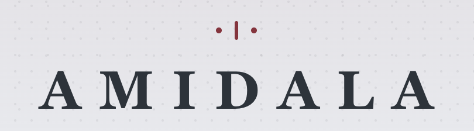
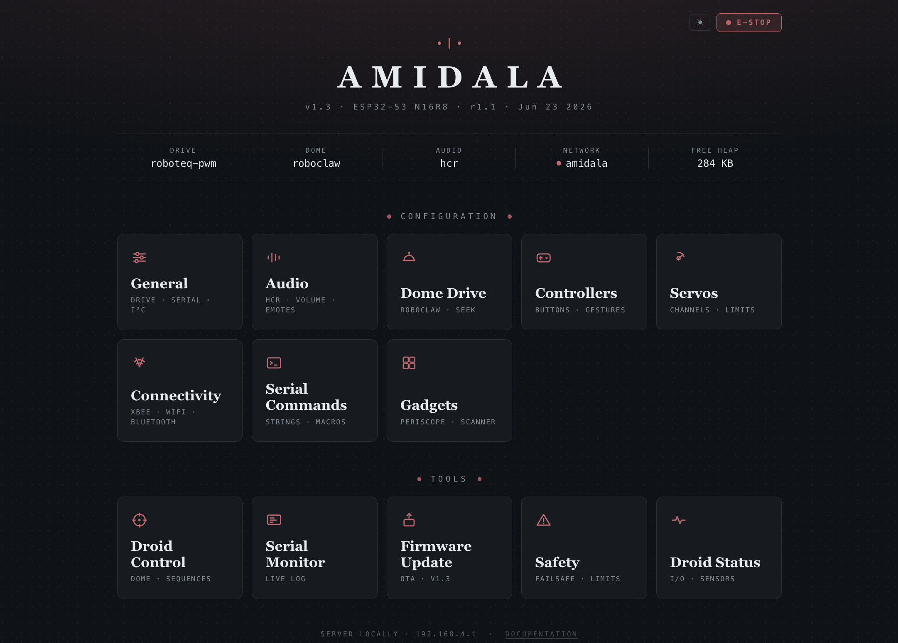
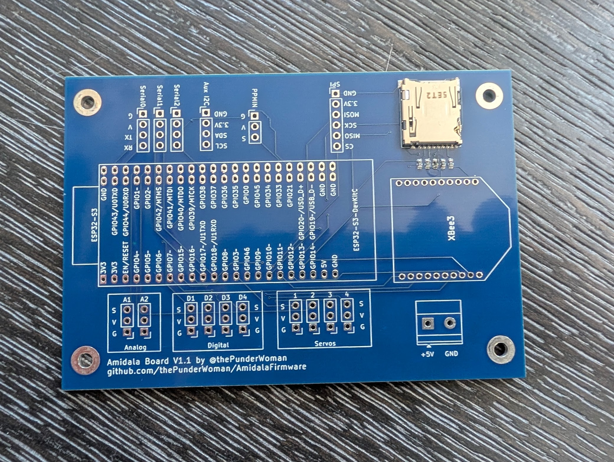
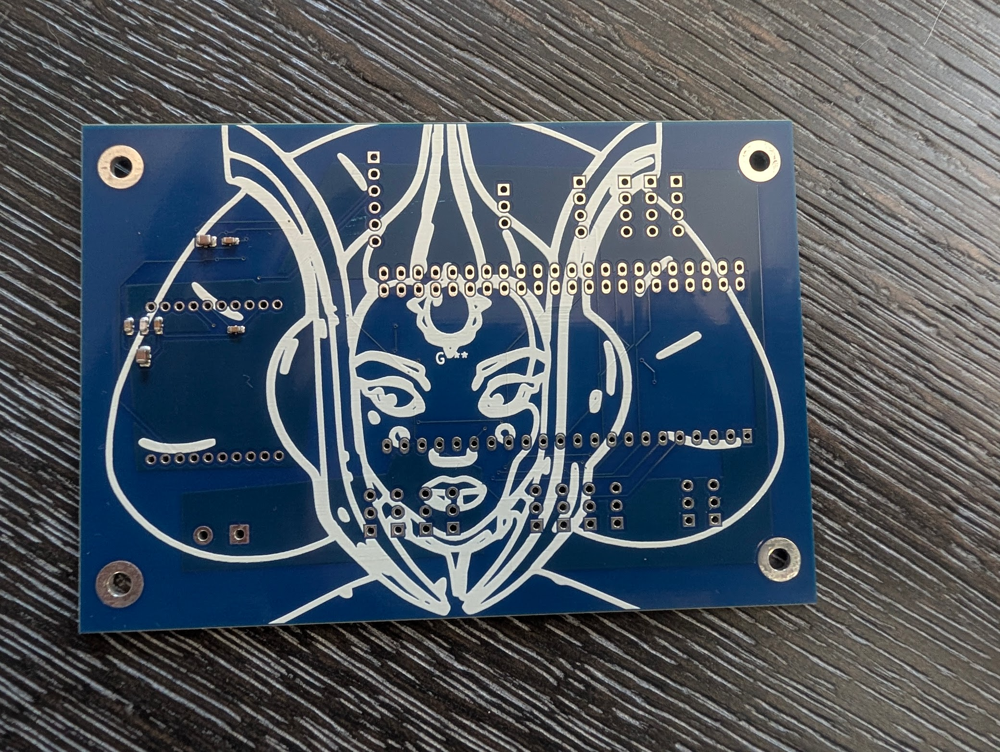

  

  
  

**Amidala** is an ESP32-S3 firmware for controlling your droids. It runs on the [Amidala PCB](PCB/) — a PCB designed to make wiring a full-featured droid build straightforward — and is compatible with both the N8R2 (8 MB flash) and N16R8 (16 MB flash) module variants.

> **Config Wizard coming soon** — a step-by-step browser wizard for generating your `config.txt` without editing a text file.
>
> **Documentation wiki coming soon** — full wiring diagrams, setup walkthrough, and advanced configuration reference.

---

## Features

- **XBee wireless control** — secure, long-range, low-latency control via XBee 3 modules
- **Multiple Controller Support** — works with classic stealth controllers, Amidala controllers, standard Bluetooth gamepads, and analog RC (PPM) input.
- **Wi-Fi configuration UI** — browser-based interface for fully configuring your droid without needing to pull the SD card.
- **Native HCR support** — full Human Cyborg Relations vocalizer integration.
- **Advanced Dome Drive** — Built-in support for auto dome drive with a Pololu encoder motor and hall sensor, or any other basic PWM dome drive.
- **Flexible drive systems** — PWM, Sabertooth serial, or RoboteQ (PWM, serial, or hybrid)
- **Native built-in safety features** — Web based e-stop, dome obstruction motor disconnect, auto motor disable on controller disconnect.
- **Layers of controller button configurations** — with short-press, long-press, and alt-modifier layers
- **Effectively unlimited serial strings and gestures** — the only limits are your imagination!
- **And more** — I2C aux output, digital outputs, analog inputs, SD card config, servo outputs, and emergency stop handling

---

## Web Configuration UI

  

The Amidala web interface allows you total control over your droid's configuration. You can set up your controller configuration, which buttons trigger what, add serial commands, set defaults for audio, dome positioning, safety timeouts, emergency stop commands, configure Bluetooth, see digital pin statuses, use the serial monitor, configure your droid's gadgets, and even use the droid control page to trigger sequences, trigger emotes, and dome controls. See more in the wiki.

## Get Started

> **[Documentation Wiki →](https://github.com/thePunderWoman/Amidala/wiki)**

The wiki covers everything from first flash through full configuration. For a quick look at every available config key, see [example_config.txt](example_config.txt) — it's a complete annotated reference used on a real build. Although once you get set up initially, you won't need to look at this file again, as you can update every config option through the web UI.

---

## The Amidala PCB

  
  

The Amidala PCB is a purpose-built carrier for the ESP32-S3, designed to consolidate all the connectors a typical R2 build needs onto a single board:

- 4 servo headers (LEDC PWM)
- 4 digital output pins
- 2 analog inputs
- 3 serial headers (UART0 primary out, UART1 RoboClaw, UART2 aux)
- Auxiliary I2C header
- Native XBee slot (SPI, no adapter needed)
- Micro SD card reader
- Additional SPI breakout
- PPM input for RC receivers

> **[PCB details, schematics, and BOM →](PCB/)**

---

## License

This project is released under the [GNU General Public License v2](LICENSE). You are free to use, modify, and distribute it — including your own modifications — as long as you share the source code of any distributed derivatives under the same license.

---

## Contributing

Bug reports and feature requests are welcome — please use the [issue tracker](https://github.com/thePunderWoman/Amidala/issues).

If you'd like to contribute code, see [CONTRIBUTING.md](CONTRIBUTING.md).
